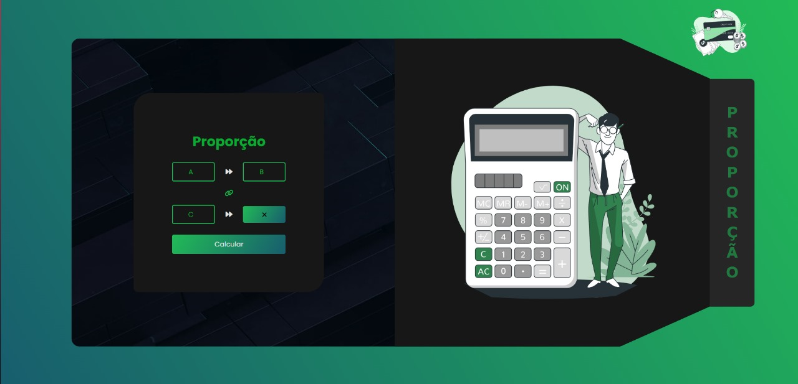

# Calculadora de Proporções - README

Este é um exemplo de código HTML, CSS e JavaScript para uma página web que implementa uma calculadora de proporções (regra de três simples). O código é destinado para fins de estudo e prática.

## Descrição

Este projeto consiste em uma página web que permite aos usuários calcular proporções simples entre três valores. A página inclui:

- Uma seção de calculadora onde os usuários podem inserir três valores (A, B e C) e calcular o valor proporcional correspondente.
- Um botão "Calcular" que executa a operação de proporção.
- Uma seção de ilustração para adicionar contexto visual à página.

## Visualização

## Conteúdo

O projeto inclui os seguintes arquivos:

- `index.html`: Este arquivo contém a estrutura HTML da página.
- `style.css`: Este arquivo contém os estilos CSS para personalizar o layout e a aparência da página. **Obs: O CSS ainda não está responsivo.**
- `script.js`: Este arquivo contém o código JavaScript responsável por realizar o cálculo da proporção quando o botão "Calcular" é clicado.

## Funcionalidades

- Os usuários podem inserir três valores numéricos nos campos de entrada fornecidos.
- Ao clicar no botão "Calcular", o código JavaScript calcula a proporção entre os valores inseridos e exibe o resultado na página.
- O código verifica se os valores inseridos são válidos (não são NaN e o valor de A não é zero) e exibe "Inválido" se os critérios não forem atendidos.
- O resultado do cálculo é exibido na página abaixo dos campos de entrada.

## Tecnologias Utilizadas

- HTML5
- CSS3
- JavaScript

## Como Utilizar

1. Clone este repositório em sua máquina local.
2. Abra o arquivo `index.html` em seu navegador da web.
3. Insira os valores desejados nos campos de entrada.
4. Clique no botão "Calcular" para ver o resultado da proporção calculada.

## Notas Adicionais

Este projeto foi criado para fins educacionais e de aprendizado. Sinta-se à vontade para explorar e modificar o código conforme necessário para seus próprios objetivos de aprendizado.

